# How to setup an Shadowsocks Server on Azure

## Foreword
*A few weeks ago, I saw the blog in MSDN, [Run Shadowsocks in Azure Container Instances](https://blogs.msdn.microsoft.com/zhiliang_xus_blog/2018/01/04/run-shadowsocks-in-azure-container-instances/). Then I followed that blog to ran a Container, but there was a problem. The Container was located in East US, and the network speed that connected from mainland of China was very slow. After some attempts, I found a faster way as shown below.*

*By the way, __if you don't need a high speed, above blog is a very good idea for you__.*

## Pre-requirement
- An Azure Global subscription (Azure in mainlan of China doesn't work)

## References
- Create and use SSH Keys
    - [How to Use SSH keys with Windows on Azure](https://docs.microsoft.com/en-us/azure/virtual-machines/linux/ssh-from-windows)
    - [How to create and use an SSH public and private key pair for Linux VMs in Azure](https://docs.microsoft.com/en-us/azure/virtual-machines/linux/mac-create-ssh-keys?toc=%2fazure%2fvirtual-machines%2flinux%2ftoc.json)
- Create a Linux VM (NGINX is not required)
    - [Create a Linux virtual machine with the Azure portal (Recommended for Azure beginners)](https://docs.microsoft.com/en-us/azure/virtual-machines/linux/quick-create-portal)
    - [Create a Linux virtual machine with the Azure CLI](https://docs.microsoft.com/en-us/azure/virtual-machines/linux/quick-create-cli)
    - [Create a Linux virtual machine with PowerShell](https://docs.microsoft.com/en-us/azure/virtual-machines/linux/quick-create-powershell)
- [How to Configure Proxy Settings in Linux](https://justintung.com/2013/04/25/how-to-configure-proxy-settings-in-linux/)
- Getting started for Shadowsocks
    - [Install](https://github.com/shadowsocks/shadowsocks/blob/master/README.md#install)
    - [Usage](https://github.com/shadowsocks/shadowsocks/blob/master/README.md#usage)
- [Shadowsocks Clients](https://shadowsocks.org/en/download/clients.html)

## Steps
1. [Create a Linux VM located in Asia](#create-a-linux-vm-located-in-asia)
2. [Install basic modules in VM located in Asia](#install-basic-modules-in-vm-located-in-asia)
3. [Create a Linux VM located in US/EU (Optional)](#create-a-linux-vm-located-in-us/eu)
4. [Set network proxy on the VM located in Asia (Optional)](#set-network-proxy-on-the-vm-located-in-asia)
5. [Setup the Shadowsocks Server on Asia VM](#setup-the-shaowsocks-server-on-asia-vm)
6. [Connect to the server on your device](#connect-to-the-server-on-your-device)

## Create a Linux VM located in Asia
You can find the detail under [References](#references). Please note below points before you create the VM:

1. OS __CentOS 6.8 (free)__ is used in this blog.

    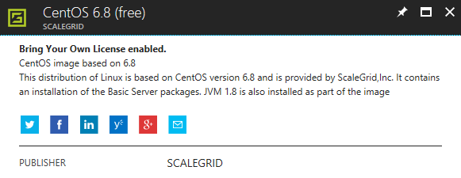

2. __Southeast Asia__, __East Asia__, __Japan__ all are good choices for this VM, please chose the best one.
3. __HDD__ is enough for this VM.

    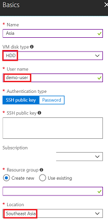

4. __A0__ is enough for this VM, you could also chose a bigger size for better performance.

    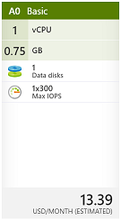

5. It will be better that set the IP as __Static__.

    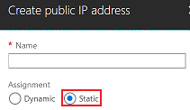

6. Remember to disable *Auto-shutdown*.

7. Set *Availability set* as your requirement.

    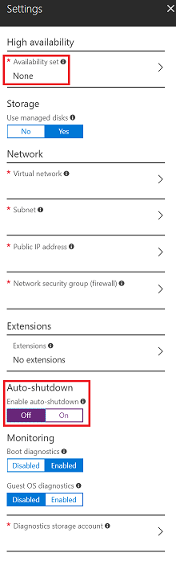

## Install basic modules in VM located in Asia
In this step, you will enable __EPEL__ and install __pip__, __git__ on your Asia VM.

1. Connect to the VM located in Asia
    - Find the IP of your VM in Azure Portal

        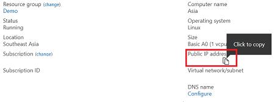
    - Connect to the VM, more detail can be found in [References - Create and use SSH Keys](#references).

2. Login with the user name you typed when creting this VM (*__demo-user__ in this blog*)

    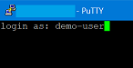

3. Switch to __root__
    ```shell
    sudo -s
    ```
    
    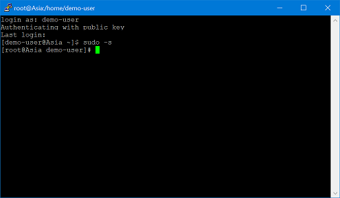

4. Enable __EPEL__
    ```shell
    wget http://dl.fedoraproject.org/pub/epel/6/x86_64/epel-release-6-8.noarch.rpm
    rpm -ivh epel-release-6-8.noarch.rpm
    ```
    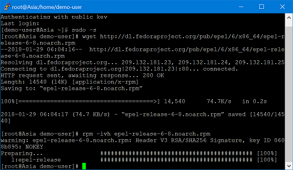

5. Install __pip__, answering *y* when it prompts
    ```shell
    yum install python-pip
    ```
    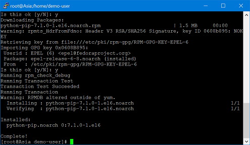

6. Install __git__, answering *y* when it prompts
    ```shell
    yum install git
    ```
    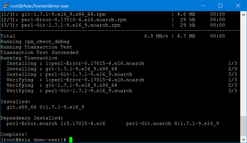

7. *Close*/`exit` this terminal

    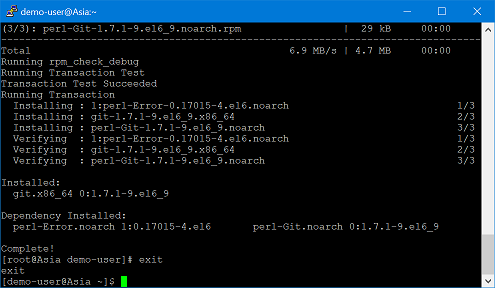

## Create a Linux VM located in US/EU
__If Asia area network is fine for you and you have no requirement to connect to US or EU area service, please skip this step and go to [Setup the Shadowsocks Server on target VM](#setup-the-shaowsocks-server-on-target-vm).__

1. Please follow steps that you have done in step [Create a Linux VM located in Asia](#create-a-linux-vm-located-in-asia), and __note below difference__:

    The *location* should be __East US__, __West US__ or other location you want.

    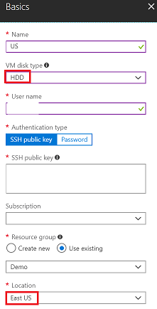

2. Configure inbound port. 
    - Go to the VM in Azure Portal    
    - Click *Networking* (under *SETTINGS*)
    - Click *Add inbound* (under *INBOUND PORT RULES*)

        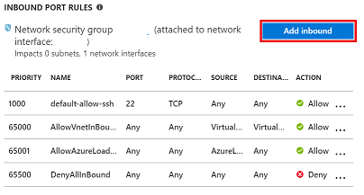
    - Enter your __Port ranges__ (*8080 in this blog*) and __Description__

        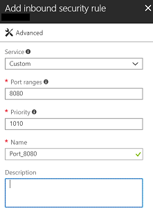

## Set network proxy on the VM located in Asia
__If Asia area network is fine for you and you have no requirement to connect to US or EU area service, please skip this step and go to [Setup the Shadowsocks Server on target VM](#setup-the-shaowsocks-server-on-target-vm).__

1. Connect to the VM located in Asia
2. Login with the user name you typed when creting this VM (*__demo-user__ in this blog*)
3. Set network proxy (*use IP and port number of your US/EU VM in last step to replace 0.0.0.0 and 8080, more information can be found at [References - How to Configure Proxy Settings in Linux](#references)*)
    ```shell
    export ftp_proxy=0.0.0.0:8080
    export http_proxy=0.0.0.0:8080
    export https_proxy=0.0.0.0:8080
    ```

    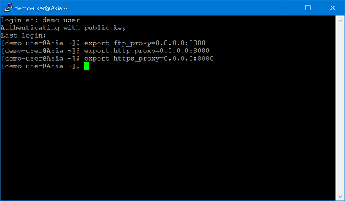

## Setup the Shadowsocks Server on Asia VM
1. Configure inbound port
    - Go to the VM in Azure Portal
    - Click *Networking* (under *SETTINGS*)
    - Click *Add inbound* (under *INBOUND PORT RULES*)

        
    - Enter your __Port ranges__ (*8388 in this blog*) and __Description__

        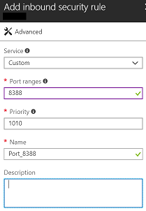
2. Configure Shadowsocks server (*detail can be found under [References - Getting started for Shadowsocks](#references)*)
    - Connect to the VM located in Asia
    - Login with the user name you typed when creting this VM (*__demo-user__ in this blog*)
    - Install __Shadowsocks__
        ```shell
        sudo pip install git+https://github.com/shadowsocks/shadowsocks.git@master
        ```

        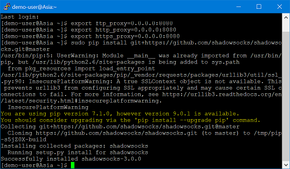
    - Start __Shadowsocks__ service on the port (*8388 in this blog, __remember to use your own password in below command__*)
        ```shell
        sudo shadowsocks.ssserver -p 8388 -k passwordHere -m aes-256-cfb
        ```
    
## Connect to the server on your device
1. Install Shadowsocks Client on your device from [Shadowsocks Clients](https://shadowsocks.org/en/download/clients.html)
2. Configure your server information in the client
3. Enjoy your networks