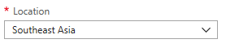

# How to setup an Shadowsocks Server on Azure

## Foreword
*A few weeks ago, I saw the blog in MSDN, [Run Shadowsocks in Azure Container Instances](https://blogs.msdn.microsoft.com/zhiliang_xus_blog/2018/01/04/run-shadowsocks-in-azure-container-instances/). Then I followed that blog to ran a Container, but there was a problem. The Container was located in East US, and the network speed that connected from mainland of China was very slow. After some attempts, I found a faster way as shown below.*

*By the way, __if you don't need a high speed, above blog is a very good idea for you__.*

## Pre-requirement
- An Azure Global subscription (Azure in mainlan of China doesn't work)

## References
- Create and use SSH Keys
    - [How to Use SSH keys with Windows on Azure](https://docs.microsoft.com/en-us/azure/virtual-machines/linux/ssh-from-windows)
    - [How to create and use an SSH public and private key pair for Linux VMs in Azure](https://docs.microsoft.com/en-us/azure/virtual-machines/linux/mac-create-ssh-keys?toc=%2fazure%2fvirtual-machines%2flinux%2ftoc.json)
- Create a Linux VM
    - [Create a Linux virtual machine with the Azure portal (Recommended for Azure beginners)](https://docs.microsoft.com/en-us/azure/virtual-machines/linux/quick-create-portal)
    - [Create a Linux virtual machine with the Azure CLI](https://docs.microsoft.com/en-us/azure/virtual-machines/linux/quick-create-cli)
    - [Create a Linux virtual machine with PowerShell](https://docs.microsoft.com/en-us/azure/virtual-machines/linux/quick-create-powershell)

## Steps
1. [Create a Linux VM located in Asia](#create-a-linux-vm-located-in-asia)
2. [Create a Linux VM located in US/EU (Optional)](#create-a-linux-vm-located-in-us/eu)
3. [Set network proxy on the VM located in Asia (Optional)](#set-network-proxy-on-the-vm-located-in-asia)
4. [Setup the Shadowsocks Server on target VM](#setup-the-shaowsocks-server-on-target-vm)
5. [Connect to the server on your device](#connect-to-the-server-on-your-device)

## Create a Linux VM located in Asia
You can find the detail under [References](#references). Please note below points before you create the VM:

1. OS __CentOS 6.8 (free)__ is used in this blog.

    

2. __Southeast Asia__, __East Asia__, __Japan__ all are good choices for this VM, please chose the best one.

    